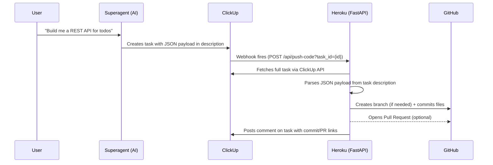

# Gaia Gitter — ClickUp-to-GitHub Code Bridge

A stateless FastAPI service hosted on Heroku that connects **ClickUp**, a **Superagent** (AI code generator), and **GitHub**. When the superagent writes code into a ClickUp task, the service automatically commits and pushes it to a GitHub repository.

## Architecture



### How It Works

1. The **user** gives a coding task to the **superagent**
2. The **superagent** generates code and writes a JSON payload into a **ClickUp task description**
3. A **ClickUp automation** detects the new/updated task and fires a webhook to the **Heroku service**
4. The **Heroku service** fetches the task from ClickUp, parses the JSON, and pushes the code to **GitHub**
5. A **comment** is posted back on the ClickUp task with the commit SHA and PR link

---

## Heroku Service

**Live URL:** `https://gaia-gitter-865dae5598b2.herokuapp.com`

**Swagger UI:** `https://gaia-gitter-865dae5598b2.herokuapp.com/docs`

### Endpoints

| Method | Path | Description |
|--------|------|-------------|
| `GET` | `/health` | Health check — returns `{"status": "ok"}` |
| `GET` | `/api/check-repo?repo=owner/name` | Verify the GitHub token can access a repo |
| `GET` | `/api/debug-task?task_id=abc123` | Fetch a ClickUp task and show its raw description + parsed JSON (for troubleshooting) |
| `POST` | `/api/push-code` | Main endpoint — commits code to GitHub (accepts JSON body or `?task_id=` query param) |
| `POST` | `/webhook/clickup` | Receives native ClickUp API webhooks (alternative to automation webhooks) |

### Environment Variables (Heroku Config Vars)

| Variable | Required | Description |
|----------|----------|-------------|
| `CLICKUP_API_TOKEN` | Yes | ClickUp personal API token (starts with `pk_`) |
| `CLICKUP_WEBHOOK_SECRET` | No | Secret for verifying native ClickUp webhook signatures |
| `GITHUB_TOKEN` | Yes | GitHub personal access token with `repo` scope |
| `COMMIT_MESSAGE_TEMPLATE` | No | Default: `ClickUp task {task_id}: {task_name}` |

### Project Structure

```
app/
  __init__.py
  main.py              # FastAPI app, all endpoints, orchestration logic
  config.py            # Pydantic Settings (reads env vars)
  models.py            # Request/response Pydantic models
  services/
    __init__.py
    clickup.py         # ClickUp API client (fetch tasks, post comments)
    github.py          # GitHub API client (commit via Git Data API, create PRs)
    parser.py          # JSON + markdown parser for task descriptions
Procfile               # Heroku: uvicorn app.main:app
runtime.txt            # Python 3.12
requirements.txt       # FastAPI, PyGithub, httpx, pydantic-settings
```

---

## JSON Payload Format

The superagent writes a single JSON object into the ClickUp task description. This same format also works as the request body for `POST /api/push-code`.

```json
{
  "github_repo": "goalz-cons/my-project",
  "github_branch": "feature/new-feature",
  "base_branch": "main",
  "files": {
    "src/__init__.py": "",
    "src/main.py": "from fastapi import FastAPI\n\napp = FastAPI()\n",
    "src/utils/helpers.py": "def add(a: int, b: int) -> int:\n    return a + b\n",
    "requirements.txt": "fastapi==0.115.6\nuvicorn[standard]==0.34.0\n"
  },
  "commit_message": "feat: add initial project structure",
  "create_pr": true,
  "pr_target_branch": "main"
}
```

### Field Reference

| Field | Type | Required | Description |
|-------|------|----------|-------------|
| `github_repo` | string | Yes | Repository in `"owner/repo"` format. Must already exist on GitHub. |
| `github_branch` | string | Yes | Target branch to commit into. Auto-created from `base_branch` if it doesn't exist. |
| `base_branch` | string | No | Branch to fork from when `github_branch` is new. Defaults to the repo's default branch (usually `main`). |
| `files` | object | Yes | `{"file/path.ext": "file contents"}` — flat dict where keys are full file paths and values are complete file contents. Use `\n` for newlines. |
| `commit_message` | string | No | Conventional commit message (e.g. `"feat: add API"`). Defaults to a template with task ID and name. |
| `create_pr` | boolean | No | `true` to automatically open a Pull Request after pushing. Default: `false`. |
| `pr_target_branch` | string | No | Base branch for the PR (e.g. `"main"`). Required when `create_pr` is `true`. |

### Notes on `files`

- Keys are **full file paths** — directory structure is implicit (e.g. `"src/utils/helpers.py"` creates the `src/utils/` directory automatically)
- Values are **complete file contents** — never partial files
- Use `""` (empty string) for empty files like `__init__.py`
- Use `\n` for newlines within file contents
- Never include binary files, `.env` with real secrets, or `node_modules`

---

## ClickUp Setup

### 1. Automation Webhook

The ClickUp automation triggers the Heroku service when a task is created or updated.

**Automation configuration:**

| Setting | Value |
|---------|-------|
| **Trigger** | "Task or subtask created" (or "Status changes to X") |
| **Condition** | Tag is any of: `codex_git` |
| **Action 1** | Change status → "IN PROGRESS" |
| **Action 2** | Call webhook → `gaia-gitter` |

**Webhook configuration:**

| Setting | Value |
|---------|-------|
| **Title** | `gaia-gitter` |
| **URL** | `https://gaia-gitter-865dae5598b2.herokuapp.com/api/push-code?task_id={id}` |
| **Headers** | `Content-type: application/json` |

The `{id}` in the URL is a ClickUp template variable that gets replaced with the actual task ID when the webhook fires.

### 2. Task Format

When creating a task (manually or via the superagent):

1. **Tag** the task with `codex_git` to trigger the automation
2. **Paste the JSON payload** directly into the task description (no code fences needed)
3. The automation fires → the service reads the JSON → code is pushed to GitHub

### 3. Custom Fields (Optional)

If you prefer using custom fields instead of (or alongside) the JSON payload:

| Field Name | Type | Example |
|------------|------|---------|
| `github_repo` | Short Text | `goalz-cons/my-project` |
| `github_branch` | Short Text | `feature/new-feature` |
| `create_pr` | Checkbox | ✅ |
| `pr_target_branch` | Short Text | `main` |

The JSON payload in the description takes priority. Custom fields are a fallback.

---

## Superagent Integration

### System Prompt

Give this to your superagent as its system/instructions prompt:

```
You are a code generation agent that produces deployment-ready code structures.

When a user describes a feature, project, or code task, you output a single JSON object that will be placed directly into a ClickUp task description. This JSON is automatically picked up by a service that commits the code to GitHub.

YOUR OUTPUT MUST BE EXACTLY ONE JSON OBJECT with this schema:

{
  "github_repo": "goalz-cons/<repo-name>",
  "github_branch": "<branch-name>",
  "base_branch": "main",
  "files": {
    "<file-path>": "<file-contents>",
    ...
  },
  "commit_message": "<conventional-commit-message>",
  "create_pr": true,
  "pr_target_branch": "main"
}

FIELD RULES:

1. github_repo — Format: "goalz-cons/<repo-name>". The repo MUST already exist. Ask the user if unsure.
2. github_branch — Use "feature/<name>", "fix/<name>", or "chore/<name>". Lowercase with hyphens.
3. base_branch — Branch to fork from. Default "main".
4. files — Flat dict of file paths to complete file contents. Use \n for newlines. Include ALL necessary files: source code, __init__.py, requirements.txt, config files, etc. Never include binary files, .env with real secrets, or lock files.
5. commit_message — Conventional Commits format: "feat: ...", "fix: ...", "chore: ...".
6. create_pr — true when ready for review, false for drafts.
7. pr_target_branch — PR base branch, usually "main".

CODE QUALITY: Write production-quality code with error handling, type hints, clear naming, and standard project structure conventions.

OUTPUT: ONLY the raw JSON object. No markdown fences, no explanation, no commentary. Must be valid JSON.
```

### Example Flow

**User says to superagent:**
> "Create a REST API for managing a todo list. Use FastAPI. Repo: goalz-cons/todo-api"

**Superagent outputs:**
```json
{
  "github_repo": "goalz-cons/todo-api",
  "github_branch": "feature/todo-crud-api",
  "base_branch": "main",
  "files": {
    "app/__init__.py": "",
    "app/main.py": "from fastapi import FastAPI\nfrom app.routes import router\n\napp = FastAPI(title=\"Todo API\")\napp.include_router(router, prefix=\"/api\")\n",
    "app/routes.py": "from fastapi import APIRouter, HTTPException\n\nrouter = APIRouter()\n_todos: dict[int, dict] = {}\n_counter = 0\n\n@router.get(\"/todos\")\nasync def list_todos():\n    return list(_todos.values())\n\n@router.post(\"/todos\", status_code=201)\nasync def create_todo(title: str):\n    global _counter\n    _counter += 1\n    _todos[_counter] = {\"id\": _counter, \"title\": title, \"done\": False}\n    return _todos[_counter]\n",
    "requirements.txt": "fastapi==0.115.6\nuvicorn[standard]==0.34.0\n",
    "Procfile": "web: uvicorn app.main:app --host 0.0.0.0 --port $PORT\n"
  },
  "commit_message": "feat: add todo CRUD API with list and create endpoints",
  "create_pr": true,
  "pr_target_branch": "main"
}
```

**This JSON is placed into a ClickUp task description → tagged `codex_git` → automation fires → code lands in GitHub.**

---

## Direct API Usage

You can also call the service directly without ClickUp, using `POST /api/push-code`:

```bash
curl -X POST https://gaia-gitter-865dae5598b2.herokuapp.com/api/push-code \
  -H "Content-Type: application/json" \
  -d '{
    "github_repo": "goalz-cons/my-project",
    "github_branch": "feature/test",
    "base_branch": "main",
    "files": {
      "hello.py": "print(\"Hello from Gaia Gitter!\")\n"
    },
    "commit_message": "feat: add hello script",
    "create_pr": false
  }'
```

**Response:**
```json
{
  "success": true,
  "commit_sha": "a1b2c3d4e5f6...",
  "commit_url": "https://github.com/goalz-cons/my-project/commit/a1b2c3d4...",
  "pr_url": null,
  "branch_created": true,
  "message": "Code committed successfully"
}
```

You can also trigger a push by passing a ClickUp task ID:

```bash
curl -X POST "https://gaia-gitter-865dae5598b2.herokuapp.com/api/push-code?task_id=86c8cnafn" \
  -H "Content-Type: application/json"
```

---

## Troubleshooting

### Debug a Task

Check what the service sees when it fetches a ClickUp task:

```
GET https://gaia-gitter-865dae5598b2.herokuapp.com/api/debug-task?task_id=86c8cnafn
```

Returns the raw description, whether JSON was detected, the parsed payload, and custom field values.

### Common Errors

| Error | Cause | Fix |
|-------|-------|-----|
| `400: github_repo not set` | JSON payload missing `github_repo` or it's empty | Add `github_repo` to the JSON in the task description |
| `400: github_branch not set` | JSON payload missing `github_branch` | Add `github_branch` to the JSON |
| `400: No files found` | No JSON payload or `files` dict detected in description | Check the task description contains valid JSON with a `files` key. Use `/api/debug-task` to inspect. |
| `502: GitHub commit failed` | GitHub API error — bad token, repo doesn't exist, or no push access | Verify the token with `/api/check-repo?repo=owner/name` |
| `Illegal header value` | API token has a trailing newline | Re-set `CLICKUP_API_TOKEN` on Heroku without trailing whitespace |
| Webhook test fails (400/500) | ClickUp test button sends a dummy task ID | This is normal — the test can't simulate a real task. Save the webhook and test with a real automation. |

### Verify GitHub Access

```
GET https://gaia-gitter-865dae5598b2.herokuapp.com/api/check-repo?repo=goalz-cons/my-project
```

Returns repo info and permissions (admin, push, pull) to confirm the token works.

### Heroku Logs

```bash
heroku logs --tail --app gaia-gitter-865dae5598b2
```

---

## Setup From Scratch

### 1. Deploy to Heroku

```bash
git clone https://github.com/pentadotddot/goalz-gaia-gitter.git
cd goalz-gaia-gitter
heroku create your-app-name
heroku config:set CLICKUP_API_TOKEN=pk_your_token_here
heroku config:set GITHUB_TOKEN=ghp_your_token_here
git push heroku main
```

### 2. Create a GitHub Token

1. Go to [github.com/settings/tokens](https://github.com/settings/tokens)
2. Generate a new token (classic) with `repo` scope
3. Set it as `GITHUB_TOKEN` on Heroku

### 3. Get a ClickUp API Token

1. Go to ClickUp → Settings → Apps
2. Generate a personal API token
3. Set it as `CLICKUP_API_TOKEN` on Heroku

### 4. Set Up ClickUp Automation

1. Go to your ClickUp Space → Automations
2. Create a new automation:
   - **Trigger:** Task or subtask created
   - **Condition:** Tag is any of `codex_git`
   - **Action:** Call webhook `gaia-gitter`
3. Configure the webhook:
   - **URL:** `https://your-app.herokuapp.com/api/push-code?task_id={id}`
   - **Header:** `Content-type: application/json`
4. Save and enable

### 5. Test

1. Create a task in the space with the automation
2. Paste a JSON payload into the description
3. Tag it with `codex_git`
4. Watch the code appear in GitHub
